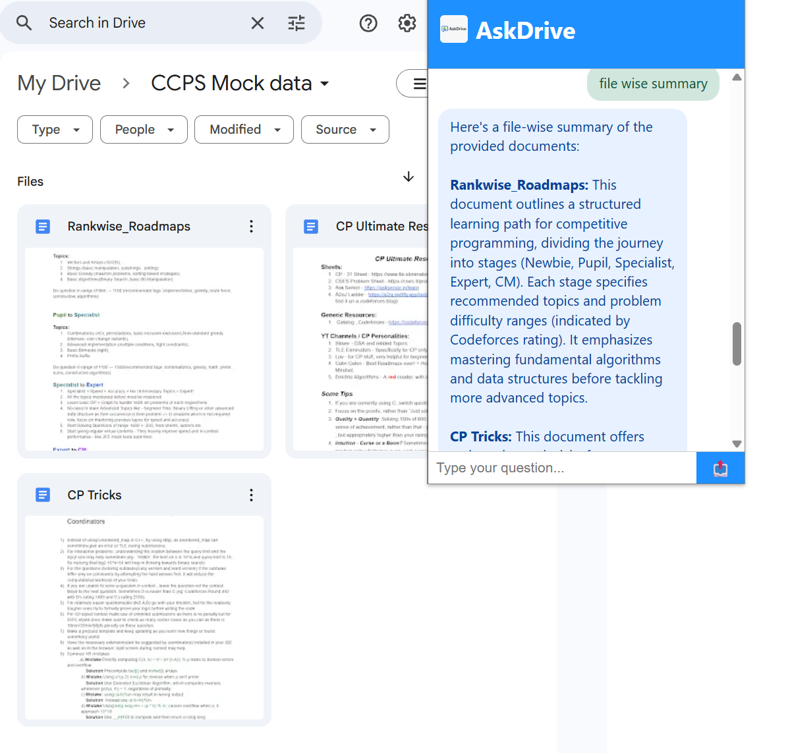

# 🚀 AskDrive – AI-Powered Google Drive Assistant

AskDrive is a **Chrome Extension** that connects directly to your Google Drive, reads your documents (Google Docs, Sheets, PDFs, and now `.docx` files 📄), and lets you **chat with your files** using Google Gemini AI.  
No more digging through folders — just ask and get instant answers.

---

## 📽 Demo Video

---

## ✨ Features

- 🔍 **Ask anything** about your Google Drive folder
- 📂 Supports multiple file types:
  - Google Docs
  - Google Sheets (all tabs)
  - `.docx` files (Word)
- 🤖 Powered by **Google Gemini AI**
- 🎯 Summarization, Q&A, and context understanding
- 💬 Chat-style interface with styled user & AI messages
- 📑 Multi-document querying (coming soon)

---

## 📸 Screenshots

Chat Interface

  

---
